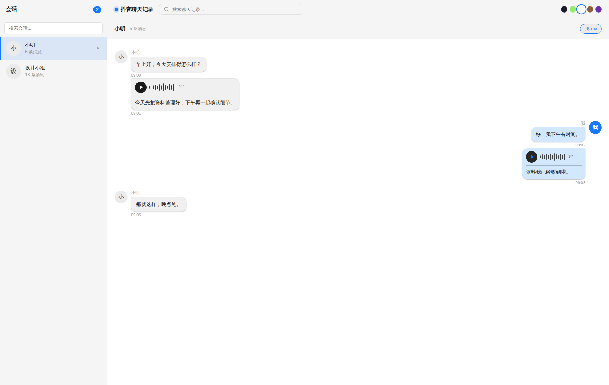
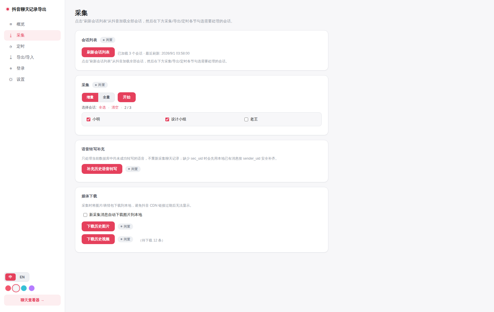

<div align="center">

# 抖音聊天记录导出工具

**从抖音网页版完整导出私信聊天记录，本地 Web 界面浏览、搜索、导出。**

直接调用抖音 IM 接口（protobuf）抓取，突破网页虚拟列表的滚动上限，可导出完整历史。

</div>

> **本项目**由 **AceovoeL** 维护：<https://github.com/AceovoeL/DouKeep-douyin-chat-export>
> 基于 **TeamBreakerr** 的原创项目 [douyin-chat-export](https://github.com/TeamBreakerr/douyin-chat-export) 修改而来，采用 MIT 许可（全文见 [LICENSE](LICENSE)，第三方素材说明见 [NOTICE](NOTICE)）。
> 控制面板（`/panel`）→ **关于** 里可以看到作者信息、当前版本号，并一键检查更新。

<div align="center">
  
</div>

> **目录** ·
> [功能](#功能) ·
> [环境要求](#环境要求) ·
> [快速开始](#快速开始) ·
> [部署](#部署) ·
> [使用](#使用) ·
> [控制面板](#控制面板) ·
> [开放 API](#开放-api) ·
> [注意事项](#注意事项)

---

## 功能

**采集**
- **完整历史** — 直接调用抖音 IM API（protobuf），突破虚拟列表滚动上限
- **精确排序** — 用服务端 `created_at_us` 单调递增序号排序，消息顺序不乱
- **增量更新** — 增量模式只抓新消息
- **多种消息类型** — 文本、表情包、图片、语音、视频、分享（视频/限时日常/商品/直播）、一起看视频、仅看一次、引用回复、系统消息
- **语音转文字** — 新消息自动转写，也可一键补充历史语音，支持浏览、搜索和导出

**浏览**（Vue 3 + FastAPI 内置界面）
- 无限滚动、右侧面板内搜索当前会话，连续月份日历定位当天首条消息、图片／视频按日期分组展示，搜索结果支持「加载更多」及一键跳转
- 消息分组、引用回复区块、图片点击放大、语音/视频在线播放与转写内容展示
- **「N 条消息」按实际显示算** — 会话列表与聊天窗口左上角只统计真正画得出来的消息：抖音对同一次事件给双方各发一份的镜像、空载荷、阅读端还不认识的通知都不计入（数据库里的原始行数见会话列表的 `message_count`，会显示在删除确认框里）
- 用户名片（头像、昵称、抖音号、粉丝数及主页链接），点赞／领取火星通知随「我」的选择切换人称
- 合并转发聊天记录可展开查看：读取内嵌正文、本地原消息，或在抓取时通过网页登录态下载并解密远端记录；缺少正文时明确显示摘要及缺失数量（[格式与限制](docs/merged-forward-records.md)）
- 5 套主题一键切换（暗色 / 微信绿 / 浅色 / 暖棕 / 紫夜），全中文界面；管理员还能在控制面板里自定义字体、配色、字号与气泡尺寸（见[控制面板](#控制面板)）

**媒体本地化**
- 图片 AES-GCM 解密 + HEIC 自动转 JPEG；语音自动落地；视频 MPEG-CENC 解密 + faststart 转封装
- **H.265 按需兼容** — 抖音的视频绝大多数是 HEVC/H.265，浏览器没有解码器时会显示「不支持的格式」；查看器在 `<video>` 报错后自动带 `?tc=1` 重试一次，由后端转成 H.264 并缓存到 `data/transcoded/videos/`，第二次播放直接命中缓存
- **坏容器自动识别** — 部分下载残留 MPEG-CENC 标签（`encv`/`enca`）的文件会被标准播放器直接拒绝，`tools/fix_media_containers.py` 可批量规范化：不带参数先预演，`--apply` 把修复副本写进 `data/videos_fixed/`，`--replace` 直接就地替换（原件留在 `data/videos_orig/`）
- 可开关「新消息自动下载」与「回填历史媒体」，避免抖音 CDN 链接过期后失效

**导出 & 运维**
- 导出 [ChatLab](https://github.com/hellodigua/ChatLab) 标准格式（JSON / JSONL），可直接做 AI 聊天分析
- **ChatLab 远程数据源** — 实现 ChatLab [Pull 协议](https://docs.chatlab.fun/cn/standard/chatlab-pull)，在 ChatLab 里添加本服务地址即可自动定时增量同步，无需手动导出导入
- 默认导出文件名包含会话名称和导出时间，多会话文件更易区分
- **开放 API** — Bearer token 鉴权的只读 REST API：按日期 / seq 区间取消息、逐日消息量统计，供外部程序集成
- **聊天长图渲染** — 一个 API 调用把任意消息区间渲染成聊天界面长图（PNG），5 套主题任选，可加标题栏
- Web 控制面板：可视化采集 / 导出 / 定时任务 / 远程扫码登录 / 密码保护
- 定时任务（勾选式时间表，底层仍是 cron）+ [Server酱](https://sct.ftqq.com) 失败推送到微信
- 纯本地运行：装一次依赖、构建一次前端即可；聊天记录在 `data/`，设置与日志在 `config/`，都不出本机

## 环境要求

本项目**没有预构建安装包，也不需要 Docker**：把代码拿到本机、装一次依赖、构建一次前端就能跑，
所有数据都留在项目目录里（见[数据放在哪](#数据放在哪)）。第一次用请先对照下表确认三样东西：

| 需要 | 版本 | 干什么用 |
|------|------|----------|
| **Python** | 3.10 或更高 | 跑后端、采集、导出 |
| **Node.js + npm** | Node.js 20.19+ 或 22.12+ | 只用来构建一次前端界面（Vite 7 的要求）；平时运行不需要它 |
| **磁盘空间** | 1 GB 以上 | 装依赖和构建产物（几百 MB），以及后面下载的聊天媒体 |

> 不确定装没装、版本对不对？Windows 双击仓库根目录的 **`start.html`**，它会自动检测并列出每一项
> （详见下面的[方式 A](#方式-a第一次用windows一键启动)）；手动看的话，在命令行里跑
> `python --version` 和 `node --version` 就够了。
>
> 另外两个**可选但建议**的依赖：**Playwright Chromium**（采集和聊天长图要用的浏览器，下面装依赖时会装）和
> **ffmpeg**（把抖音的 H.265 视频按需转成 H.264，浏览器才播得动；不装只是这类视频播不了）。
> 这两样缺了服务照样能起来，面板 **关于 → 环境检测** 里会逐项告诉你缺什么。

## 快速开始

第一次用有三种方式，按自己的系统挑一种即可。**下面所有命令都在项目根目录执行**。

### 方式 A：第一次用（Windows，一键启动）

Windows 上推荐从仓库根目录的 **`start.html`** 开始，全程不用记命令：它先逐项检测环境
（Python、pip、Node.js、npm、端口 8000 等，每项都标出「需要什么版本、当前是什么版本」），
**必要条件没过完弹窗关不掉**，按提示装好再回来点「重新检测」；通过后自动跑完剩下的
（建虚拟环境 → 装 Python 依赖 → 装前端依赖 → 构建前端 → 起服务，首次可能要几分钟），
服务就绪后自动跳到控制面板。

首次打开时页面还不能自己执行本地命令（浏览器的安全限制），会给你一条一次性命令：
点「复制命令」→ 按 `Win + R` → `Ctrl + V` → 回车。之后就能直接在页面里点按钮。

> 第一次进控制面板会问一句要不要下载**资源包**（一次性素材，下过一次就不再问）；
> 跳过之后可以在 **关于 → 资源包** 里补下，也能在命令行跑 `python tools/download_emoji.py`。

以后就不需要 `start.html` 了：直接**双击 `启动服务（双击）.bat`**，服务在后台跑起来、浏览器
自动打开控制面板；服务已在跑时再双击只会打开面板，**不会启动第二个**。停下来用面板
**日志 → 停止程序**。

### 方式 B：Windows，用命令行

不想双击、想看命令输出时，在项目根目录打开 PowerShell：

```powershell
git clone https://github.com/AceovoeL/DouKeep-douyin-chat-export.git
cd DouKeep-douyin-chat-export

# 一键跑完全流程：建虚拟环境 → 装依赖 → 构建前端 → 启动服务（等价于方式 A 双击做的事）
powershell -ExecutionPolicy Bypass -File .\start.ps1
```

`start.ps1` 是幂等的：已经建好的虚拟环境、已经装好的依赖会跳过，可以放心反复运行。
它的输出直接打在窗口里；要停下来就在这个窗口按 `Ctrl + C`，或用面板 **日志 → 停止程序**。

### 方式 C：macOS / Linux，或想自己一步步来

`start.sh` 也会自己装前端依赖、构建前端并启动服务，但**不会建 Python 虚拟环境**，
所以先手动把 Python 这边准备好，再让它接手：

```bash
git clone https://github.com/AceovoeL/DouKeep-douyin-chat-export.git
cd DouKeep-douyin-chat-export

python3 -m venv venv
source venv/bin/activate
pip install -r requirements.txt
playwright install chromium       # 采集和聊天长图要用的浏览器

./start.sh                        # 装前端依赖 → 构建前端 → 启动服务 → 打开浏览器
```

也可以完全手动，四步和上面脚本做的一模一样（适合排错或想自己控制每一步）：

```bash
python3 -m venv venv
source venv/bin/activate          # Windows: venv\Scripts\activate
pip install -r requirements.txt
playwright install chromium

cd frontend && npm install && npm run build && cd ..

python3 -m uvicorn backend.main:app --host 127.0.0.1 --port 8000
```

> **前端那一步不能省**（`npm install && npm run build`）：后端启动时会去找 `frontend/dist/`，
> 没有这份构建产物，聊天浏览页就打不开（控制面板本身不受影响）。
> Node.js 版本不对时 `npm run build` 会直接报错，见下面的「[Node.js 版本不对？](#node-版本不对)」。

启动成功后：

| 地址 | 打开的东西 |
|------|-----------|
| `http://localhost:8000/panel` | 控制面板（先在这里**登录**，见[登录](#1-登录)） |
| `http://localhost:8000` | 聊天查看器（采集完成后在这里浏览） |

> 用上面这些脚本启动时，服务输出会落到 `config/logs/server.log`（面板 **日志** 页读的就是这份）；
> 自己敲 `uvicorn` 启动则只打在终端里。
> 停止服务用面板 **日志 → 停止程序**，或关掉那个终端 / 跑 `./stop.sh`。

## 部署

本项目只支持**源码运行**，不提供 Docker 镜像，也没有预构建产物。装在什么机器上，数据就放在那台机器的项目目录里（见下）。

装法和启动步骤都在上面的[快速开始](#快速开始)里（Windows 双击 `启动服务（双击）.bat` / 跑 `start.ps1`；
macOS、Linux 用 `./start.sh`），这一节只讲跑起来之后要管的事：数据放在哪、更新、环境变量、局域网访问、反向代理。

### 数据放在哪

项目目录里只有两个会自己长大的目录，都已被 `.gitignore` 排除，升级代码不会动它们：

| 目录 | 放什么 | 删了会怎样 |
|------|--------|-----------|
| `data/` | **聊天记录**：`chat.db` 数据库、下载的图片/表情/语音/视频、导出的聊天文件与数据库备份 | 聊天记录没了 |
| `config/` | **设置与运行状态**：面板设置 `panel_config.json`、私有仓库凭据 `github_token`、登录态 `browser_profile/`、日志 `config/logs/` | 回到默认设置、需要重新登录，聊天记录不受影响 |

备份就备份这两个目录；只在乎聊天记录的话，备份 `data/` 就够。出问题时要看的日志都在
`config/logs/`（面板 **日志** 页也是读这里）。

### 更新到新版本

控制面板 → **关于 → 检查更新** 会比对版本并列出每个待更新版本的变更，确认后点 **立即更新**：

```bash
# 换代码：有 .git 就 git pull，没有就把最新代码包解压覆盖进目录
pip install -r requirements.txt                 # 依赖有变化时（每次都跑也无害）
cd frontend && npm install && npm run build && cd ..
# 然后自动重启服务：新代码先试启动一次，通过了才换掉旧服务
```

**更新完会自动重启服务**（默认勾选）：整个过程只中断几秒。想自己控制重启节奏（例如用 nssm / 计划任务托管）就取消勾选。
重启回来后会弹「**更新完成**」，里面写着当前版本和这次更新包含哪些版本、各改了什么；**2 分钟**后收进屏幕右下角的常驻提示，
那条常驻提示要你点「×」才消失。这条提示只弹一次（内容记在 `config/update-done.json`）。

**目录里有没有 git 都能一键更新**：

| 目录情况 | 点「立即更新」实际做的事 |
|----------|--------------------------|
| 自己 `git clone` 下来的 | `git pull --ff-only`；有未提交改动会先停下问你，不覆盖任何东西 |
| 拷贝来的副本、ZIP 解压的目录、本机没装 git | 下载默认分支的代码包并解压覆盖目录里的代码文件（下载时实时打印进度） |

两条路都只换仓库里的代码文件：`data/`、`config/`、`venv/`、`frontend/node_modules/` 不会被覆盖。

> 拷贝来的副本没有 git 记录，检查不出本地改动：更新时代码文件会被直接换成最新版，不要在那上面手改代码。
> 这条「下载代码包覆盖」的路需要面板里配好 GitHub 只读凭据、并打开开发者模式（下载要认证，缺了时代理会停下并提示手动更新）。

不想用面板就手动执行上面的命令（`python tools/update.py` 就是面板调用的脚本，另有 `--allow-dirty`、`--archive` 两个参数）。
升级前建议先备份 `data/`（聊天记录）和 `config/panel_config.json`（设置）。

### 环境变量（可选）

| 变量 | 默认值 | 说明 |
|------|--------|------|
| `HEADLESS` | `false` | 设成 `true` 时采集用无头浏览器，适合没有桌面的服务器（本机自己用建议留着默认，能看到浏览器更容易发现异常） |
| `DOUYIN_FFMPEG` | (空) | 指定 ffmpeg 可执行文件的路径，省去自动查找 |

另外，`python3 scheduler.py` 这个独立定时脚本会读三个变量：`SCRAPER_SCHEDULE`（cron 表达式，如 `0 */6 * * *`；留空表示只跑一次就退出）、`SCRAPER_FILTER`（只采集指定会话）、`SCRAPER_INCREMENTAL`（默认 `true`，设成 `false` 走全量）。日常定时用控制面板的 **定时** 分区就够了，不必手写这些。

### 局域网访问（让手机、平板也能看）

先在 **关于** 页最下面打开 **开发者模式**，**设置** 页才会出现 **局域网访问** 这一块：

* **向局域网开放**：打开后服务会监听 `0.0.0.0`，同一个 Wi-Fi / 局域网里的设备用「这台电脑的 IP + 端口」就能打开：

  | 地址 | 打开的东西 |
  |------|-----------|
  | `http://192.168.x.x:8000/panel` | 控制面板 |
  | `http://192.168.x.x:8000` | 聊天查看器 |

  IP 是多少、能用的完整地址是哪些，面板这一节里会直接列出来。改这个开关需要重启一次服务才能生效（uvicorn 的监听地址是启动参数），面板会自动完成这次重启，页面自己刷回来。

* **访问需要密码**：默认不设。设了之后，局域网里的设备第一次打开面板或查看器要先输入这个访问密码；输过的设备会被记住，之后不用再输。每个输过密码的设备都会出现在 **信任设备** 列表里，可以随时单独「不再信任」或「全部取消信任」—— 取消之后那台设备下次访问要重新输入。

这个访问密码和上面那个**面板密码是两把独立的锁**：访问密码决定「这台设备允不允许连上来」，面板密码决定「打开面板 / 查看器的人要不要登录」。两个都设了，别的设备就要先输访问密码、再输面板密码。本机（`127.0.0.1`）访问不受访问密码限制。

> 这个开关只影响是否监听 `0.0.0.0`，本身不提供公网防护：要把服务暴露到公网，请走下面的反向代理 + HTTPS。

### 挂到反向代理

服务默认只监听 `127.0.0.1:8000`（自带访问密码，见控制面板 → 设置）。要让外网访问，
建议前面放一层 Nginx / Caddy 反向代理到这个地址并配 HTTPS，不要把这个端口直接暴露到公网。

<details id="node-版本不对">
<summary>Node.js 版本不对？</summary>

Vite 7 要求 Node.js **20.19+** 或 **22.12+**，推荐用 [nvm](https://github.com/nvm-sh/nvm) 管理：

```bash
curl -o- https://raw.githubusercontent.com/nvm-sh/nvm/v0.40.3/install.sh | bash
nvm install 22 && nvm use 22
node -v   # 确认 >= 22.12
```

Windows 用户可用 [nvm-windows](https://github.com/coreybutler/nvm-windows) 或从 [Node.js 官网](https://nodejs.org/) 下载 LTS。
</details>

### 界面回归检查（可选）

改动「查找聊天记录 → 图片与视频」之后，可以用 `tools/` 里的浏览器端到端检查代替手动点击：

```bash
python tools/verify_media_search_ui.py          # Windows: venv\Scripts\python.exe tools\verify_media_search_ui.py
```

它会自己拉起一个后端（随机端口，不影响正在运行的实例），用无头浏览器核对打开停在最新处、日期正序、加载更早时阅读位置不跳、滚到顶部自动续拉等 9 项行为，失败时返回码为 1。依赖本机 Edge / Chrome（没有时回退到 Playwright 自带的 chromium）。

### 面板页面快照（改面板之后跑一次）

`tests/baseline/panel.html` 是控制面板页面的冻结快照，测试会拿它和实际页面**逐字节**比对。所以只要动了 `backend/panel/static/panel.html`（加个动画、改句话都算），就得顺手同步快照，否则 CI 会红。用这个脚本，两步并一步：

```bash
python tools/sync_panel_baseline.py            # 只对比并打印差异，不写入
python tools/sync_panel_baseline.py --apply    # 同步快照，然后跑一遍 pytest
# Windows: venv\Scripts\python.exe tools\sync_panel_baseline.py --apply
```

先看第一行命令打印出来的差异，确认改动是有意为之，再加 `--apply`。同步完记得把 `tests/baseline/panel.html` 一起提交。

## 使用

### 1. 登录

首次使用需登录抖音，三选一：

<details open>
<summary><b>方式 A：本地浏览器扫码</b>（需 clone 仓库）</summary>

在装了 Playwright 的机器上运行，会弹出真实浏览器窗口让你扫码；登录态直接写进
项目的 `config/browser_profile/`：

```bash
# 需先装 Playwright：pip install playwright && playwright install chromium
python3 login.py
```

扫码成功后浏览器自动关闭，重启一下后端服务（或直接在面板里开始采集）即可生效。
</details>

<details>
<summary><b>方式 B：Cookie 导入</b>（最简单，推荐）</summary>

在任意浏览器登录抖音后导出 Cookie：

1. 打开 `douyin.com` 并登录
2. `F12` → **Application** → **Cookies** → `https://www.douyin.com`
3. 右键 Cookie 表格空白处 → **Copy all cookies**
4. 控制面板 `/panel` → **登录** → **导入 Cookie**，粘贴导入

支持 JSON 数组（DevTools Copy all cookies）和 `key=value; key=value` 字符串（`document.cookie`）两种格式。
</details>

<details>
<summary><b>方式 C：控制面板远程扫码</b></summary>

`/panel` → **登录** → **扫码登录**，通过截图远程操作服务端浏览器。适合临时使用，延迟较高。
</details>

登录态保存在 `config/browser_profile/`，跟着项目目录走。

### 2. 采集

在控制面板 **采集** 分区可视化操作（增量/全量切换、勾选会话、实时日志），或用命令行：

```bash
python3 extract.py                          # 全量采集所有会话
python3 extract.py --filter "会话名称"        # 精确匹配昵称，多会话用英文逗号分隔
python3 extract.py --filter "会话名称" --incremental   # 增量（只取新消息）
python3 extract.py --no-download-images     # 不下载媒体图片（默认会下载）
python3 extract.py --refresh-fields         # 字段回填：不清库，只补整包字段与操作标记
python3 extract.py --transcribe-voices      # 只补充本地数据库中的历史语音转写
```

采集时会把抖音返回的消息包整包留档（`message_packets` 表，含撤回 / 编辑 /
表情快捷回复 / 仅看一次的判定依据），并默认把图片、表情、视频封面和语音文件
下载到 `data/media/`；已经下载过的文件会自动跳过。

### 3. 导出为 ChatLab 格式

导出 [ChatLab](https://github.com/hellodigua/ChatLab) 标准格式，可直接导入做 AI 分析：

```bash
python3 export.py --filter "会话名称"                    # JSONL（默认）
python3 export.py --filter "会话名称" --format json      # JSON
python3 export.py --filter "会话名称" --output data/export.jsonl
```

未指定 `--output` 时，文件会自动命名为 `会话昵称_YYYYMMDDHHMMSS_export.jsonl`（或 `.json`）；显式指定输出路径时保留用户给出的文件名。

导出内容：文本、表情文字标签、图片、语音时长与转写文字、视频时长、分享链接、用户名片、商品卡片、引用/回复关系和合并转发正文。也可在控制面板 **导出/导入** 分区一键操作。

- 图片优先内嵌本地已下载文件，缺失时使用缩略图或未加密的远端链接；无法取得可用图片时标记「图片未下载」。内嵌图片会增加导出文件体积。
- 合并转发使用 ChatLab 的 FORWARD 类型，正文按发送者整理成文本；未取得的条目明确标为摘要，不会当作完整正文导出。
- 普通回复和可匹配的视频引用写入 `replyToMessageId`。群聊保留群聊类型和成员名称。
- 此格式面向聊天分析：表情、语音和视频不会打包成可播放的媒体附件。SQLite 备份也不包含 `data/media/`，完整备份需另外保存该目录。

若采集时出现 `[media] emoji 失败 ... CERTIFICATE_VERIFY_FAILED`，这是媒体下载的证书校验失败，并非 ChatLab 文件写入失败。下载器使用系统证书库及公共 CA 证书；升级后请重新执行 `pip install -r requirements.txt`。使用自签证书的代理时，需要将其 CA 正确加入系统信任库，或通过 `SSL_CERT_FILE` 指向可信的 PEM 证书文件。不要关闭 TLS 校验。

新采集的语音会自动转写。对已经保存的历史消息，可在控制面板 **采集** 分区点击「补充历史语音转写」，或执行 `python3 extract.py --transcribe-voices`。任务只处理尚未完成的语音，不会重新采集全部聊天记录；缺少的发送者信息会在需要时自动补充。

### 4. ChatLab 自动同步（远程数据源）

不想反复手动导出导入的话，可以让 ChatLab 自己来拉：本服务实现了 ChatLab 的
[Pull 远程数据源协议](https://docs.chatlab.fun/cn/standard/chatlab-pull)（只读 GET，用开放 API 的 token 鉴权）。

在 ChatLab（桌面版 / CLI / Docker 均可）**设置 → 自动化 → 远程数据源** 里添加：

| 字段 | 填写 |
| --- | --- |
| 地址 | `http://<本服务地址>:8000`（ChatLab 会自动补上 `/api/v1`） |
| Token | `config/panel_config.json` 里的 `api_token`（或 `GET /api/token`） |

然后从列表里勾选要同步的会话。ChatLab 首次会分页拉取全部历史，之后按你设置的间隔自动增量拉取；
消息按 `platformMessageId` 去重，反复拉取不会产生重复。对应端点：

| 端点 | 说明 |
| --- | --- |
| `GET /api/v1/sessions` | 可同步的会话列表（`keyword` / `limit` 可选） |
| `GET /api/v1/sessions/{conv_id}/messages?format=chatlab&since=0&limit=1000` | ChatLab 格式消息 + `sync` 分页块 |

- 与文件导出相比，通过数据源同步的消息**不内嵌图片**（图片写为 `[图片]` 标签），其余转换规则相同。
- `since` 被当作水位线并向前回看 7 天：本服务是定时批量采集、消息时间戳早于采集时间，而 ChatLab 拉取出错时会把游标重置为当前时间，回看窗口保证这种情况下也不会漏消息（重复部分由 ChatLab 去重）。返回的 `nextSince` 已包含该偏移，ChatLab 原样回传即可，正常情况下每次只从上一页末尾继续。

### 5. 导出整个数据库

在控制面板 **导出/导入** 分区选择「整个数据库（SQLite，可导入）」即可备份完整聊天数据库。需要恢复时，选择之前导出的 SQLite 文件并点击「导入并覆盖数据库」；导入前会自动保留当前数据库备份。导入或恢复前请先停止正在运行的采集和媒体下载任务。

## 控制面板

访问 `/panel`，侧栏分区管理全部功能：

<div align="center">
  
</div>

| 分区 | 功能 |
|------|------|
| **概览** | 会话数 / 消息数 / 用户数 |
| **采集** | 刷新会话列表、增量/全量切换、勾选会话、语音转写补充、图片/视频本地下载、实时日志 |
| **定时** | 勾选式时间表（每天 / 每周 / 每月 + 几点），实时写出人话摘要；少见写法收在高级里的 cron 输入框 |
| **导出/导入** | 按会话导出 ChatLab JSON/JSONL；整库导出 SQLite；校验后覆盖导入并自动备份旧库 |
| **登录** | 远程扫码、Cookie 导入、检查/清除登录态 |
| **设置** | 访问密码、Server酱 失败通知、外观自定义、中英文切换 |
| **日志** | 看后端服务日志与重启过程日志，可自动刷新、打开日志文件夹；**重启服务**（重建前端再启动）、**停止程序**（退出并释放 8000 端口） |
| **关于** | 作者与仓库链接、当前版本号、检查更新、定时自动检查更新、环境检测、资源包、开发者模式 |

> **开发者模式**（关于页最下面）打开后才会多出两项进阶功能：关于页的 **私有仓库凭据**、
> 设置页的 **局域网访问**；关着时它们不显示。一拨就生效，不用点「应用」。
> 关掉前会先问一句：局域网正开着就一起关掉（**访问密码和已信任的设备都留着**）并重启一次服务。
> 私有仓库凭据只有在你把项目放回自己的私有仓库改着用时才需要，保存过的 Token 不会被删。

<details>
<summary><b>任务出错时会发生什么（弹窗 / 自动暂停 / 右下角提示）</b></summary>

**采集**、**语音转写补充**、**下载历史图片**、**下载历史视频**、**刷新会话列表** 出错时用的是同一个弹窗：

| 弹窗上的东西 | 说明 |
|--------------|------|
| 出错原因 + 日志 | 标题按任务换（采集遇到错误 / 刷新会话列表遇到错误 …），下面是错误内容和最近的日志 |
| 倒计时 | **2 分钟**，到点自动关掉并让任务继续（人在旁边看日志时可以点「忽略并继续」提前继续） |
| 停止 | 「停止采集」「停止刷新」等，点了就把这个任务停掉 |
| 右下角常驻 | 弹窗关掉后错误不会消失，会缩到屏幕右下角，**要你点「×」才收起**（点「查看详情」能展开全文） |

出错时那个任务会被**自动暂停**（浏览器子进程一起冻住），所以你慢慢看也不会有超时；
同时冒出多个错误时一次只弹一个，其余排着队（弹窗上会写「还有 N 个错误待处理」）。
登录失效这类还没开始跑就失败的情况也会弹窗说明原因（这时没有任务可暂停，弹窗只报错）。

</details>

<details>
<summary><b>为什么刷会话列表 / 开始采集要等 5 秒</b></summary>

抖音的私信页是**前端异步渲染**的：页面刚打开时只画出一部分会话，剩下几秒才补齐。
所以程序**每次打开或重载私信页之后都会固定等 5 秒**，再去读会话列表、滚动、点会话，
否则可能只拿到原来一半左右的会话，或者报「重新加载后未找到会话」。

会等的两步：

| 什么时候 | 为什么 |
|----------|--------|
| 刚进私信页（刷新会话列表 / 开始采集都从这里进） | 不等会只收集到一部分会话 |
| 采集时为了拿 short_id 重载页面之后 | 不等的话，重载前点得到的会话重载后可能找不到，那个会话这次就抓不到 |

代价是采集会慢一些：每个单聊会话在重载页面后多等这 5 秒（群聊不需要重载，不受影响）。
这是拿几秒钟换「不漏会话」，划得来。

</details>

<details>
<summary><b>定时采集怎么设（勾选就行，不用写 cron）</b></summary>

**定时** 分区是一排勾选框，从上到下依次是「多久一次 → 哪天 → 几点」：

| 勾什么 | 管什么 |
|--------|--------|
| 重复：每天 / 每周 / 每月 | 多久跑一次 |
| 星期几（选每周时出现）/ 每月哪几天（选每月时出现） | 具体哪一天，可多选；旁边有 工作日 / 周末 / 1日 / 1日、15日 / 全选 / 清空 的快捷按钮 |
| 几点执行（24 个小时都能勾，可多选）+ 分钟 | 一天里跑几个时间点；分钟那一项是所有时间点共用的 |
| 常用 | 每天晚上 8 点 / 每天早 8 点 + 晚 8 点 / 每周一晚 8 点 / 每周一、周四晚 8 点 / 每月 1 日晚 8 点 / 每月 1、15 日早 8 点 + 晚 8 点，点一下就填好 |

下方会实时写出一句人话摘要（例如「每周一、周四晚上8点自动采集」），确认没问题再点 **应用**；
改过还没应用时会显示「有改动还没应用」的提示（这时候状态自动刷新不会覆盖你正在勾的东西）。
开关关着时点「应用」只是关掉定时采集，想让它跑就把开关打开再点一次。

勾选框表达不了的写法（「每 6 小时」「只在 6 月跑」「日期和星期都要」）收在最下面的
**高级：直接写 cron 表达式** 里，老的 `分 时 日 月 周` 写法照旧可用；面板读到这种表达式时
会自己把高级输入框展开，并说明当前用的是自定义表达式。
</details>

<details>
<summary><b>关于页与更新（版本号 / 更新内容）</b></summary>

侧栏底部的版本徽标点一下就能进 **关于** 页，里面有作者信息、两个仓库的链接和当前版本号。

**检查更新** 比对的是本机代码与远端分支，不需要远端有 `vX.Y.Z` 标签，没有 `.git` 的目录也能检测：

| 情况 | 面板表现 |
|------|----------|
| 版本一致 | 绿色提示「已是最新版本 x.y.z」，可点「查看变更」去仓库看提交记录 |
| 有新版本 | 红色提示「发现新版本 x.y.z（落后 N 个 commit）」，并弹出确认框逐版本列出更新内容 |
| 读不到仓库 | 提示读不到更新源（网络不通、远端读不到时），并给出仓库链接，可手动更新 |

**立即更新** 会依次换代码 → 装依赖 → 构建前端 → 自动重启服务（日志实时显示在页面下方，
重启过程与新服务输出都在 `config/logs/` 里，面板 **日志** 页都能看）。

> 「更新完成后自动重启服务」默认勾选；取消勾选则更新完只提示你手动重启（用 nssm / 计划任务托管服务时适用）。

> 工作区有**未提交的改动**时更新会先停下（只列出改动文件，不覆盖任何东西），面板上会多出一个 **仍然更新** 按钮。
> 拷贝来的副本没有 git 记录，检查不出本地改动，代码文件会被直接覆盖，所以不要在那上面手改代码。

### 定时自动检查更新

不想每次自己点的话，在 **关于 → 版本与更新** 里打开「定时自动检查更新」，时间表和「定时」页的定时采集一样
（每天 / 每周几 / 每月哪几天 + 好几个整点），点 **应用** 即可：

- 到点后跑一次和手动「检查更新」相同的比对，结果显示在设置下面，侧栏版本号旁亮红点；
- 配过 [Server酱](https://sct.ftqq.com) 的话，发现新版本会推一条微信通知（含逐版本变更）；
- 默认**只检查、不下载**，升级仍要在面板上点 **立即更新**；
- 服务没开着时错过的那次不补跑；关掉开关就完全不会自动检查。

设置存在 `config/panel_config.json` 的 `update_schedule` 字段里，重启后自动恢复。

### 发现新版本时自动更新（默认关）

同一个卡片里的开关 **发现新版本时自动更新** 打开后，到点检查发现有新版本就直接走一遍和 **立即更新** 相同的流程
（拉代码 → 装依赖 → 构建前端 → 自动重启服务），装完弹一条「更新完成」。下面这几种情况**只发通知、不装**：

| 情况 | 为什么 |
| --- | --- |
| 采集、语音转写补充、下载历史图片 / 视频、刷新会话列表、导出正在跑 | 更新完要重启服务，正在跑的任务会被掐断 |
| 已经有一次更新在进行中 | 不重复启动同一件事 |
| 本地代码有**未提交的改动** | 这个岔路口需要人来决定「要不要覆盖」，无人值守时不该替你选 |

> **没有 git 记录的电脑不会被拦**：拷贝来的副本照样自动更新，走的是**下载代码包覆盖**，仓库里手工改过的代码文件不会保留
> （`data/`、`config/`、`venv/`、`frontend/node_modules/` 不受影响），微信通知里会先说明这一点。

出问题不会静悄悄地什么都没发生：面板会弹提示（两分钟后收进右下角常驻），配了 Server酱 还会推一条微信通知，
两处都会写明出了什么事、日志在哪儿。更新成功但没能自动重启时，提示里会直接写「请手动重启服务」。

</details>


<details>
<summary><b>外观自定义（字体 / 主题 / 尺寸）</b></summary>

设置页的 **外观** 分区可以改控制面板和聊天查看器的长相，改完点 **保存外观** 即可，
配置存在 `config/panel_config.json` 的 `appearance` 字段里，**所有人和所有设备看到的是同一套样式**。

| 分组 | 可以调什么 |
|------|-----------|
| 字体 | 界面字体、聊天字体。点字段弹出居中的选择框（每款字体用自己的字形显示名字，划过去就在上方预览）；内置常见中文字体，Chrome / Edge 里还能点「读取本机字体」授权后选本机已装的字体 |
| 面板配色 | 4 套内置主题 + 「自定义」：页面背景、卡片与侧栏、控件背景、主色、正文/次级/弱化文字、边框、成功/错误/警告色 |
| 面板布局 | 圆角、卡片内边距、侧栏宽度、字号缩放、阴影强度 |
| 查看器配色 | 5 套内置主题 + 「自定义」：页面背景、顶栏与卡片、控件背景、我方与对方气泡（含渐变末端）、气泡文字、正文/次级/弱化文字、边框、主色、搜索高亮、系统通知背景与文字、卡片背景与边框 |
| 查看器布局 | 消息字号、文字表情大小（`[钱]`、`[憨笑]` 这类表情图片相对字号的倍数，默认 1＝跟文字一样大）、会话列表字号、行高、气泡圆角与内边距、气泡最大宽度、头像大小、消息间距、会话列表宽度、表情包/图片/视频最大边长（三项分开调） |

颜色和尺寸项都经过取舍，只留了改了能一眼看出来的；太偏门的（浮层背景、滚动条颜色、
价格文字色、语音气泡宽度、商品卡宽度等）已经去掉。

设置页顶部有**三块实时预览**：面板（侧栏、卡片、状态色、按钮、输入框）、会话列表
（标题栏、搜索框、三个会话条目、选中态）、聊天（顶栏、系统通知、双方气泡与头像、时间、
分享卡片、图片、搜索高亮）。能调的项基本都能在预览里看到效果，调一下变一下，
点保存才写进服务器。

- **选择类字段全是弹窗**：字体、面板主题、查看器主题、阴影强度都做成按钮，点开后是居中的圆角选择框（跟着面板配色走，有淡入淡出），列表里每项都能一眼看出效果（字体用自己的字形显示、主题带配色圆点），鼠标划过去还能在上方预览
- **数值项右侧标范围**：每个数字输入框右边直接写着它的合法区间（例如「圆角 0–32 px」「字号缩放 0.8–1.5 ×」），填超了服务端也会自动夹回范围内
- **单项恢复**：每个输入框右边的小 ↺ 把它恢复成默认值；顶部「恢复默认外观」一键全部还原
- **导出 / 导入**：把整套外观存成 `panel-appearance.json`，或从文件导入（导入的非法值会被自动过滤）
- **访客行为**：查看器右上角最左边那颗圆点是「服务器样式」（默认），其余圆点只是**本机临时覆盖**，点回第一颗即恢复服务器样式；字号/字体/间距在任何主题下都生效
- **聊天长图**：`GET .../screenshot` 的 `theme` 参数新增 `auto`，表示用服务器上这套外观

</details>

<details>
<summary><b>配置失败通知（Server酱）</b></summary>

适合开了定时任务的用户：cookie 失效、抖音接口变动导致采集失败时主动推送，免去定时查面板。

1. 到 [sct.ftqq.com](https://sct.ftqq.com) 用微信登录，复制 SendKey（形如 `SCT...`）
2. 控制面板 → **设置** → 通知 → 粘贴 SendKey → **设置**
3. 点 **测试** 验证微信能收到

后续每次采集失败（含定时任务）自动推送：

```
抖音聊天导出 · 采集失败
失败时间: 2026-05-26 18:42:11
原因: 采集失败 (exit code 2)
日志末尾:
  [+] 浏览器已启动
  [*] 等待扫码登录...
  [-] 未能登录，退出
```

</details>

## 开放 API

只读 REST API，方便外部程序（脚本、机器人、数据分析）访问已导出的数据。

**鉴权**：首次启动自动生成永久 API token，存于 `config/panel_config.json` 的 `api_token` 字段
（也可 `GET /api/token` 查看）。请求时带 `Authorization: Bearer <token>`。
API token 只授权 **GET** 端点——删除操作和控制面板仍需面板密码登录。未设面板密码时所有接口无鉴权。

| 端点 | 说明 |
| --- | --- |
| `GET /api/conversations` | 会话列表（支持 `search` / 分页） |
| `GET /api/conversations/{conv_id}/messages` | 消息分页（`before_seq` / `after_seq`） |
| `GET /api/conversations/{conv_id}/messages/by-date?date=2025-07-28&tz=8` | 某个自然日的全部消息（`tz` 为时区偏移小时，默认 +8） |
| `GET /api/conversations/{conv_id}/messages/range?start_seq=100&end_seq=200` | seq 闭区间消息 |
| `GET /api/conversations/{conv_id}/stats/daily?tz=8` | 逐日消息量统计 |
| `GET /api/conversations/{conv_id}/screenshot?...` | **消息区间渲染成聊天长图（PNG）**，见下 |
| `GET /api/v1/sessions` | ChatLab 远程数据源：会话发现（见[自动同步](#4-chatlab-自动同步远程数据源)） |
| `GET /api/v1/sessions/{conv_id}/messages?format=chatlab&since=&limit=` | ChatLab 远程数据源：分页拉取 ChatLab 格式消息 |
| `GET /api/search?q=关键词` | 搜索；可加 `conv_id`、`start_time`、`end_time`、`media_type=image/video/media`、`page`、`page_size`，日期／媒体筛选时可省略 q |
| `GET /api/messages/{msg_id}/forward` | 合并转发详情；返回 `items`、`total`、`available`、`missing`、`complete` |
| `GET /api/users/{uid}` | 用户信息（昵称 / 头像） |

> 会话列表的 `display_count` 与消息接口的 `total` 都是「界面上真正显示出来的条数」，
> 不等于数据库里的原始行数（镜像副本、空载荷不计）；原始行数是会话列表的
> `message_count`（删除确认框里显示的那个）。

**聊天长图渲染**：服务端用无头浏览器打开内置浏览界面的截图模式，整段消息渲染为一张 PNG
（表情包 / 图片 / 引用 / 撤回标记与网页端完全一致，全程本地渲染，内容不出机器）：

```bash
curl -H "Authorization: Bearer $TOKEN" -o chat.png \
  "http://localhost:8000/api/conversations/<conv_id>/screenshot?start_seq=100&end_seq=160&theme=warm&title=THE%20DAY&subtitle=Jul%2028%2C%202025&self_uid=<你的uid>"
```

| 参数 | 说明 |
| --- | --- |
| `start_seq` / `end_seq` | 消息 seq 闭区间（跨度上限 2000） |
| `theme` | `dark` / `wechat` / `light` / `warm` / `purple`（默认 `dark`），或 `auto` = 用控制面板里配置的自定义外观 |
| `title` / `subtitle` | 可选标题栏两行文字，留空则无标题栏 |
| `self_uid` | 哪个 uid 显示在右侧（"我"）；可从 `/api/users` 或网页端「设置我」确认 |
| `width` | 渲染宽度 px，默认 520 |
| `scale` | 设备像素比，默认 2（高清） |

## 注意事项

- 本工具仅用于导出**自己的**聊天记录备份，请勿用于非法用途
- 抖音可能随时更改接口导致工具失效
- 媒体 CDN URL 有签名有效期（约 1 年），过期后未本地化的图片/表情将无法显示
- 语音文件自动下载到 `data/media/voice/`，不受 CDN 过期影响
- 语音转写失败后可通过再次采集或「补充历史语音转写」重试
- 控制面板可开启「图片本地下载」，将图片和表情包持久化到 `data/media/`
- 抖音的视频**大部分是 H.265/HEVC**。查看器已经做按需转码，浏览器里能正常播放；
  但用 **Windows 自带播放器**打开本地文件仍需安装商店里的「HEVC 视频扩展」，
  否则只会提示「不受支持的格式」（PotPlayer / VLC / 网盘自带解码或服务端转码，不受影响）
- 按需转码的产物都在 `data/transcoded/videos/`，可以整个删掉，会按访问需要重建

## 许可

本项目采用 **MIT** 许可，全文见 [LICENSE](LICENSE)；里面同时保留了上游原创项目 TeamBreakerr 的版权声明。

第三方素材（抖音官方表情图片、界面图片、favicon 等）版权归北京抖音信息服务有限公司所有，
**不在 MIT 许可范围内**：表情图片不随仓库分发，由第一次运行时下载到本机 `assets/emoji/`；
界面素材与 favicon 随代码附带，只为还原界面观感。详见 [NOTICE](NOTICE)。
